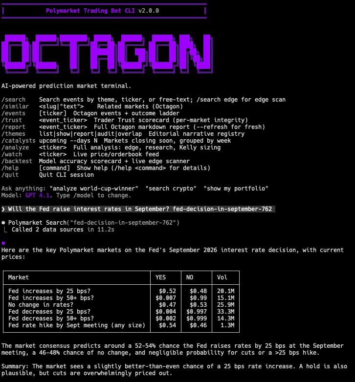
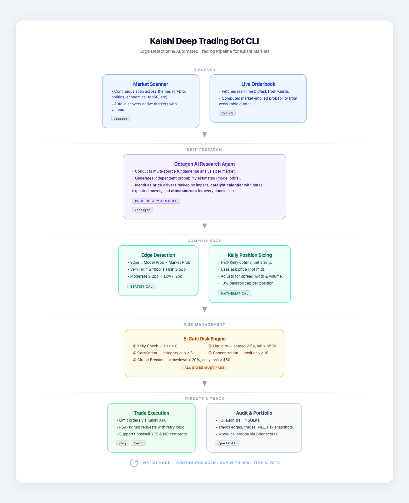

# Polymarket Trading Bot CLI

AI-powered Polymarket trading CLI that finds edge and executes trades.

> **⏳ Port in progress.** This CLI began as a port of the Kalshi trading bot. Market data,
> search, analysis, watch and portfolio reads run natively against Polymarket
> (Gamma / CLOB / Data APIs) and need no credentials. Two groups of commands are
> gated and say so when you run them:
>
> - **Awaiting an Octagon repoint** — `similar`, `events`, `series`, `trust`, `report`.
>   Octagon supports Polymarket on its venue-generic API; this client still calls the
>   Kalshi-scoped routes.
> - **No Polymarket equivalent on Octagon** — `clusters`, `peers`, `correlate`, `basket`.
>
> **Order placement is not implemented yet** — `buy`, `sell` and `cancel` return a clear
> error. Polymarket orders need EIP-712 wallet signing and on-chain USDC/CTF allowances.

Runs deep fundamental research on every market — independent probability estimates, ranked price drivers, catalyst calendars — then computes edge as the spread between model price and the live order book. Signals are sized using half-Kelly and filtered through a 5-gate risk engine before a dollar is risked.

Integrates with the [Octagon Research API](https://app.octagonai.co) for AI-generated probability estimates that power the edge detection engine.



## Prerequisites

- **[Bun](https://bun.com/) ≥ 1.1** (required — the bot uses `bun:sqlite` and runs `.tsx` directly; Node.js won't work)
  ```bash
  curl -fsSL https://bun.com/install | bash
  ```
- A **Polymarket** account (a Polygon wallet with USDC) — required for trading only; market data and research work without one
- One **LLM provider key** (OpenAI / Anthropic / Google / xAI / OpenRouter / Ollama). The setup wizard collects these on first run.
- Optional: an **[Octagon](https://app.octagonai.co)** key for AI edge analysis, and a **Tavily** key for web research.

## Quick Start

```bash
bunx polymarket-trading-bot-cli@latest
```

That's it — no clone, no install. The setup wizard runs automatically on first launch and walks you through API keys.

Prefer a global install? `bun add -g polymarket-trading-bot-cli` then run `polymarket`.

> **Scripting and agent use** — for parallel invocations, `--json` consumers, or anything that pipes our output: **install globally and use the `polymarket` binary**, not `bunx`. See [Scripting & Parallel Use](#scripting--parallel-use) below for the gory details.

Or work from a clone:

```bash
git clone https://github.com/OctagonAI/polymarket-trading-bot-cli.git
cd polymarket-trading-bot-cli
bun install
bun start
```

### Where things live

- **Config, cache, SQLite DB:** `~/.polymarket-bot/`
- **API keys (`.env`):** `~/.polymarket-bot/.env` — written by the setup wizard. A `.env` in the current directory takes precedence (handy for dev).
- **First run** with no keys configured triggers the setup wizard automatically.

### Updating

Using `@latest` in the `bunx` command always pulls the newest published version — so `bunx polymarket-trading-bot-cli@latest` is the zero-friction path.

If you ran `bunx polymarket-trading-bot-cli` without `@latest`, Bun may serve a cached copy. Force a refresh:

```bash
bunx polymarket-trading-bot-cli@latest   # pin latest for this invocation
bun pm cache rm                      # or clear Bun's install cache
```

If you installed globally with `bun add -g polymarket-trading-bot-cli`:

```bash
bun update -g polymarket-trading-bot-cli         # update in place
bun add -g polymarket-trading-bot-cli@latest     # or reinstall pinned to latest
```

Check your installed version with `polymarket --version` (or `bun pm ls -g | grep polymarket`).

## Example Session

```text
$ bunx polymarket-trading-bot-cli@latest

Welcome to Polymarket Trading Bot CLI
Type help for commands, or just ask a question.

> search crypto

  Ticker                  Title                          Last    Volume
  KXBTC-26APR-B95000      Bitcoin above $95k by Apr 30   $0.58   12,841
  KXBTC-26APR-B100000     Bitcoin above $100k by Apr 30  $0.31    8,203
  KXETH-26APR-B2000       Ethereum above $2k by Apr 30   $0.72    5,419

3 markets found

> analyze KXBTC-26APR-B95000

  Octagon Research Report — KXBTC-26APR-B95000
  ─────────────────────────────────────────────
  Model Probability   72%
  Market Price        58%
  Edge               +14.0%  (very_high confidence)

  Top Drivers
  1. Bitcoin ETF inflows accelerating            impact: high
  2. Halving cycle momentum                      impact: high
  3. Macro risk-on sentiment                     impact: moderate

  Kelly Sizing
  Recommended: 3 contracts YES at $0.58
  Risk gates: ✓ Kelly  ✓ Liquidity  ✓ Correlation  ✓ Concentration  ✓ Drawdown

> buy KXBTC-26APR-B95000 3 58

  ✓ Order placed: BUY 3 YES @ $0.58
  Order ID: abc-123-def

> portfolio

  Ticker                  Side  Qty  Entry   Now    Edge    P&L
  KXBTC-26APR-B95000      YES    3   $0.58   $0.61  +11.0%  +$0.09

  Cash: $487.26 · Exposure: $1.74 · Positions: 1
```

## Commands

| Command | Description |
|---------|-------------|
| `search [theme\|ticker\|query]` | Find markets by keyword or theme (Octagon-backed when key set) |
| `search edge [--min-edge N]` | Scan all markets by model edge (Octagon `markets-with-edge`) |
| `similar <ticker\|"query">` | Semantic neighbors via Octagon embeddings — **⏳ not yet available for Polymarket** |
| `clusters [--label X]` | Browse thematic clusters of the market universe — **⏳ not yet available for Polymarket** |
| `clusters <id>` | List markets inside a cluster — **⏳ not yet available for Polymarket** |
| `clusters --behavioral` | Behavioral clusters by 30-day return vectors — **⏳ not yet available for Polymarket** |
| `clusters --ranked` | Rank clusters by historical basket return — **⏳ not yet available for Polymarket** |
| `peers <ticker>` | Markets in the same cluster as a ticker — **⏳ not yet available for Polymarket** |
| `correlate <t1> <t2> [...]` | Pairwise Pearson correlation matrix — **⏳ not yet available for Polymarket** |
| `basket build` | Diversified basket with cluster + correlation caps — **⏳ not yet available for Polymarket** |
| `basket backtest` | NAV summary: total return, Sharpe, max drawdown, win rate — **⏳ not yet available for Polymarket** |
| `basket size` | Fractional Kelly sizing for picked legs — **⏳ not yet available for Polymarket** |
| `basket candles` | OHLC bars for a weighted basket NAV — **⏳ not yet available for Polymarket** |
| `basket validate` | One-call portfolio diagnostics (clusters, correlations, calendar clashes, warnings) — **⏳ not yet available for Polymarket** |
| `basket size --auto-probs` | Auto-fetch model probabilities via `markets/edge` and Kelly-size — **⏳ not yet available for Polymarket** |
| `basket backtest --theme <name>` | Resolve an editorial theme to a NAV basket and backtest it — **⏳ not yet available for Polymarket** |
| `series events <ticker>` | List events inside a series — **⏳ not yet available for Polymarket** |
| `events` / `events <ticker>` | Octagon events list + outcome ladder per event — **⏳ not yet available for Polymarket** |
| `series` / `series <ticker>` | Series rollup (24h vol, market count) — **⏳ not yet available for Polymarket** |
| `series candles <ticker>` | Series-level NAV (basket of top sub-markets) — **⏳ not yet available for Polymarket** |
| `catalysts upcoming --days N` | Markets closing in the next N days, grouped by week |
| `trust <event_ticker>` | Trader Trust scorecard — per-market integrity scores (table view) — **⏳ not yet available for Polymarket** |
| `trust <event> --market <market>` | Single-market Trader Trust detail card (use `--verbose` for evidence) — **⏳ not yet available for Polymarket** |
| `report <ticker>` | Full Octagon markdown report for an event (accepts event/market/series/URL). `--refresh` forces a fresh pull. — **⏳ not yet available for Polymarket** |
| `themes` (registry) | Editorial narrative buckets — list/show/import/create/delete/add-series |
| `themes report` | 25-theme dashboard with SEO + liquidity |
| `themes audit` | Flag dead themes (high SEO + zero volume) |
| `themes overlap` | Cross-theme dedupe report |
| `analyze <ticker>` | Deep analysis: edge, drivers, Kelly sizing |
| `watch <ticker>` | Live price and orderbook feed |
| `watch --theme <theme>` | Continuous theme scan |
| `buy <ticker> <count> [price] [yes\|no]` | Buy contracts — **⏳ trading not implemented yet** |
| `sell <ticker> <count> [price] [yes\|no]` | Sell contracts — **⏳ trading not implemented yet** |
| `cancel <order_id>` | Cancel a resting order — **⏳ trading not implemented yet** |
| `backtest` | Model accuracy scorecard + live edge scanner |
| `portfolio` | Positions, P&L, risk snapshot |
| `setup` | Re-run setup wizard (inside TUI) |
| `init` | Launch setup wizard from CLI (`polymarket init`) |
| `clear-cache` | Delete local cache and rebuild (`polymarket clear-cache`) |
| `help [command]` | Detailed help for a command |

### Flags

| Flag | Description |
|------|-------------|
| `--json` | JSON output for scripts and agents |
| `--refresh` | Force fresh Octagon report (analyze, report) |
| `--performance` | Include win rate, Sharpe, Brier scores (portfolio) |
| `--dry-run` | Scan without persisting edges (watch) |
| `--verbose` | Verbose output |
| `--min-edge <n>` | Minimum edge threshold in pp (backtest default 0.5) |
| `--interval <min>` | Scan interval in minutes (watch) |
| `--live` | Force 15m scan interval (watch) |
| `--days <n>` | Lookback period in days (backtest, default 15) |
| `--max-age <n>` | Reject predictions older than N days (backtest, default = `--days`) |
| `--resolved` | Resolved markets only (backtest) |
| `--unresolved` | Open markets only (backtest) |
| `--category <cat>` | Filter by category (backtest, search edge) |
| `--limit <n>` | Max results to show (search edge, default 20) |
| `--min-volume <n>` | Min per-contract volume (from Octagon snapshot; falls back to lifetime if missing). Backtest default 1. |
| `--min-price <n>` | Min contract price, 0-100 scale (backtest, default 5) |
| `--max-price <n>` | Max contract price, 0-100 scale (backtest, default 95) |
| `--export <path>` | Export per-market CSV (backtest) |
| `--top-k <n>` | Number of neighbors (similar); legs per cluster (clusters --ranked) |
| `--behavioral` | Use behavioral clustering (clusters, peers) |
| `--ranked` | Rank clusters by historical basket return (clusters) |
| `--label <substr,...>` | Filter by cluster label substring (clusters, basket build) |
| `--close-before <iso>` | Only markets closing before this timestamp |
| `--window-days <n>` | Correlation lookback (correlate; basket build) |
| `--correlation-interval <1h\|1d>` | Override candle bin size for correlate |
| `--timeframe <1w\|1m\|3m\|6m\|1y>` | Window/bin size for basket commands |
| `--weights <csv>` | Comma-separated weights for basket backtest/candles |
| `--bankroll <usd>` | Bankroll for Kelly sizing (basket size/build) |
| `--kelly <0-1>` | Kelly multiplier (default 0.25) |
| `-n <n>` | Basket size requested (basket build) |
| `--max-per-cluster <n>` | Cap legs per thematic cluster (basket build) |
| `--max-corr <-1..1>` | Pairwise correlation cap (basket build) |
| `--min-return <n>` | Minimum total_return for clusters --ranked |
| `--series <ticker>` | Filter to a series (search, similar, basket) |
| `--sort-by <key>` | Sort key for search edge: edge_pp \| expected_return \| total_volume \| model_probability |
| `--probs <csv>` | Per-leg probabilities, e.g. `KX-A:0.62,KX-B:0.55` |
| `--tickers <csv>` | Comma-separated tickers (correlate, basket backtest/candles) |
| `-q "text"` | Free-text anchor for similar / basket build |
| `--show-cluster` | Print cluster membership only (peers) |
| `--theme <name>` | Resolve an editorial theme to a ticker list (basket backtest/candles/validate/size) |
| `--aggregate-by series` | Roll up search results to the series level |
| `--active-only` | Drop non-active markets (defensive flag — open universe by default) |
| `--series-prefix <prefix>` | Server-side series prefix match (e.g. `KXBTC` matches KXBTCD, KXBTCY, ...) |
| `--sides yes,no,yes` | Per-ticker side for `correlate` (sign-flipped) |
| `--cells` | Include per-cell detail (overlap, reason) in `correlate` |
| `--auto-probs` | `basket size`: auto-fetch model probabilities via `markets/edge` |

### Discovery & Portfolio (Octagon-powered)

The `search`, `similar`, `clusters`, `peers`, `correlate`, and `basket` commands turn the whole market universe into a queryable database. When `OCTAGON_API_KEY` is set the bot routes searches through Octagon's typed endpoints — semantic embedding lookups, nightly k-means clusters (thematic + behavioral), Pearson correlation matrices, and one-call diversified basket construction with cluster caps and pairwise-correlation gates. Without a key, `search` and `search edge` fall back to the local SQLite cache.

```bash
# Free-text + structured search (semantic full-text + filters)
polymarket search "bitcoin price" --category crypto --min-volume 10000 --limit 20

# Edge ranking from Octagon's latest run (server-side, no local pre-fetch)
polymarket search edge --min-edge 5 --limit 10 --sort-by total_volume

# Semantic neighbors — catches matches keyword search misses
polymarket similar KXBTCD-26DEC31-T100000 --top-k 25
polymarket similar -q "Will Bitcoin pierce six figures" --category crypto

# Browse the universe by theme
polymarket clusters --label fed                 # find Fed-decision clusters
polymarket clusters 42                          # markets in cluster 42
polymarket clusters --behavioral                # behavioral clusters (mean ret + vol)
polymarket clusters --ranked --timeframe 1y --min-return 0.20 --top-k 5

# Same-theme dedup
polymarket peers KXBTCD-26DEC31-T100000 --kind thematic --limit 50
polymarket peers KXBTCD-26DEC31-T100000 --show-cluster     # which cluster does this belong to?

# Pairwise correlation matrix — most-uncorrelated pairs first
polymarket correlate KXBTCD-... KXETHU-... KXSOL-... --window-days 90

# Build a diversified basket (one HTTP call — universe → cluster cap → corr cap → sizing)
polymarket basket build --category crypto --min-volume 10000 \
  -n 8 --max-per-cluster 2 --max-corr 0.6 \
  --bankroll 1000 --kelly 0.25 \
  --probs KXBTCD-...:0.62,KXETHU-...:0.58

# "Find me 5 uncorrelated bets on macro themes" — one HTTP call
polymarket basket build --label fed,cpi,fomc,gdp,jobs \
  -n 5 --max-per-cluster 1 --max-corr 0.4

# Backtest a basket and read total_return / Sharpe / max DD directly
polymarket basket backtest --tickers KX-A,KX-B,KX-C --weights 0.4,0.4,0.2 --timeframe 1y

# Kelly-size legs you've already picked
polymarket basket size --bankroll 1000 --kelly 0.25 --probs KX-A:0.62,KX-B:0.55

# Or let Octagon's model fill in the probabilities for you
polymarket basket size --auto-probs --tickers KX-A,KX-B,KX-C --bankroll 1000 --kelly 0.25
polymarket basket size --auto-probs --theme "AI Race Milestones" --bankroll 1000 --kelly 0.25

# Diversified basket builder over an explicit candidate pool
polymarket basket build --tickers KX-A,KX-B,KX-C,KX-D -n 3 --max-per-cluster 1 --max-corr 0.5
polymarket basket build --theme "Iran Escalation" -n 4 --max-per-cluster 1 --max-corr 0.5 --auto-probs --bankroll 1000

# Sanity-check a proposed basket before placing orders (one call, server-side)
polymarket basket validate --tickers KX-A,KX-B --bankroll 1000 --max-corr 0.5
polymarket basket validate --theme "Iran Escalation" --bankroll 1000
#   → cluster breakdown, pairwise correlations (top by |corr|), calendar
#     clashes (weeks where many legs resolve), duplicate underliers, warnings.
```

### Editorial Theme Dashboard

`themes` is a local registry of editorial narrative buckets (e.g. "AI Race Milestones", "Iran Escalation") that maps to lists of series with optional monthly search-volume annotations. The bot ships with a 25-theme seed dataset in `data/themes_seo.json`. Distinct from Octagon's ML clusters — these are *narratives* you curate.

```bash
# Seed from the included starter dataset (25 themes, 173 series mappings)
polymarket themes import

# Browse the registry
polymarket themes list
polymarket themes show "Iran Escalation"

# THE dashboard view: 25-theme grid with SEO + liquidity
polymarket themes report

# Flag dead themes (high SEO + zero active inventory)
polymarket themes audit
#   → Epstein / Celebrity Trials   STALE         4.3M searches, 0 active markets
#   → RFK Jr Changes Health        NO_INVENTORY  422k searches, 0 active markets
#   → AI Race Milestones           TRADEABLE     138M searches, 28 active mkts
#   → Bitcoin Breakout             TRADEABLE     29k searches, 270 active mkts

# Cross-theme dedupe (when a series belongs to multiple themes)
polymarket themes overlap
#   → KXUSAIRANAGREEMENT  Iran Escalation · Nuclear Renaissance
#   → KXMORTGAGERATE      Fed Cuts Aggressively · Housing / Mortgage Crisis

# Build/manage your own themes
polymarket themes create "My Macro Hedge" --label "..." --tickers KXRECSSNBER,KXCPIYOY
polymarket themes add-series "My Macro Hedge" KXFEDDECISION,KXU3
polymarket themes set-search-volume "My Macro Hedge" 50000

# Backtest an entire theme as a NAV basket (one top market per series)
polymarket basket backtest --theme "Iran Escalation" --timeframe 3m
polymarket basket candles --theme "Fed Cuts Aggressively" --timeframe 1y --json

# Series-level rollup and NAV
polymarket series list --min-volume 10000              # liquid series, ranked
polymarket series KXBTCD --limit 10                    # drill in
polymarket series candles KXBTCD --timeframe 3m        # series NAV momentum
polymarket series search bitcoin --limit 10            # keyword → rollup

# Event ↔ outcome ladder
polymarket events --category Politics --limit 10       # top political events by volume
polymarket events KXFEDCHAIRNOM-29                     # outcome probabilities + per-contract edge

# Catalyst calendar
polymarket catalysts upcoming --days 14 --min-volume 5000 --category Politics
```

### Backtesting

Does the model find real edge? Look back N days, compare what the model said then to where the market is now.

- **Resolved** — scored against settlement (YES=100%, NO=0%)
- **Unresolved** — mark-to-market vs current market price

**Methodology (matches Supabase reference):**
- Per-contract `mp`/`kp` come from `outcome_probabilities` on each Octagon snapshot — no event-level fallback.
- Tradeability gate uses per-contract `volume`/`volume_24h` from the snapshot when present; falls back to lifetime volume for pre-API-change cached snapshots.
- `--min-edge` defaults to 0.5pp so the 0-5% edge bucket stays visible; each signal is tagged with an `edge_bucket` label (`0-5%`, `5-10%`, ..., `90%+`).
- `flat_bet_roi` is capital-weighted: `sum(pnl) / sum(capital)`, where `capital = kp/100` for YES edges and `(100 - kp)/100` for NO edges.

```bash
polymarket backtest                              # 15-day lookback (default)
polymarket backtest --days 30                    # 30-day lookback
polymarket backtest --max-age 14                 # only score predictions <=14d old
polymarket backtest --resolved                   # resolved only
polymarket backtest --unresolved --min-edge 10   # unresolved, 10pp threshold
polymarket backtest --category crypto            # filter by category
polymarket backtest --min-volume 10 --min-price 5 --max-price 95   # tradeable contracts only
polymarket backtest --export results.csv         # per-market detail
```

```text
Octagon Backtest — 15-day lookback (04/02 – 04/17)
══════════════════════════════════════════════════════════

  Events         83
  Markets        247   (142 resolved, 105 unresolved)
  Brier (Octagon)   0.168
  Brier (Market)    0.192
  Skill Score       +12.5%  [95% CI: +4.1% to +20.8%]
  Hit rate          61.4%  [95% CI: 54.2% to 68.1%]
  Flat-bet P&L      +$14.38 (ROI: +7.8%)

RESOLVED (142 markets)
  Ticker                    Model   Mkt Then   Outcome   Edge    P&L
  KXBTC-26APR-B95000        72%     58%        YES 100%  +14pp   +$0.42
  ...

UNRESOLVED (105 markets)
  Ticker                    Model   Mkt Then   Now       Edge    M2M
  KXBTC-26MAY-B110000       71%     58%        68%       +13pp   +$0.10
  ...
```

### Demo Mode

Set `POLYMARKET_USE_DEMO=true` in your `.env` to use the exchange demo environment. All trades are simulated — no real money at risk.

## Scripting & Parallel Use

The `bunx polymarket-trading-bot-cli@latest …` form is great for one-off interactive use, but it has two gotchas when you script against it:

**1. Install chatter leaks into `--json` output.** Bun prints lines like `Resolving dependencies` and `Saved lockfile` to stdout *before* our CLI runs, which corrupts JSON pipelines.

**2. Parallel invocations race on the install cache.** Running multiple `bunx polymarket-trading-bot-cli@latest …` calls in parallel can fail with `Failed to link …: EEXIST` and `could not determine executable`. See [oven-sh/bun#12917](https://github.com/oven-sh/bun/issues/12917) for current upstream status — `bunx`'s ephemeral install path isn't covered by the `bun install` global-store fix, so the workarounds below are still the recommended path.

**Recommended pattern for scripts and agents:**

```bash
# Install once globally — this is parallel-safe and emits no install chatter on subsequent runs
bun add -g polymarket-trading-bot-cli

# Then use the `polymarket` binary directly — fan out as much as you want
parallel -j 30 'polymarket analyze {} --json > {}.json' ::: KXBTC-26APR-B95000 KXETH-… …
```

**If you must use `bunx`:**

```bash
# --silent suppresses Bun's install chatter (keeps your CLI's stdout clean)
bunx --silent polymarket-trading-bot-cli@latest analyze KXBTC-26APR-B95000 --json

# For parallel bunx, pre-warm the cache serially first to dodge the link race
bunx --silent polymarket-trading-bot-cli@latest --version    # one-shot, populates cache
parallel -j 30 'bunx --silent polymarket-trading-bot-cli@latest analyze {} --json' ::: KXBTC-… …
```

Keep `@latest` if you want auto-update on every invocation; drop it after the first run if you've pinned a version and want speed.

## Agent Usage

Every command supports `--json` for structured output, making the bot easy to orchestrate from scripts or AI agents.

```bash
polymarket search crypto --json
polymarket similar KXBTC-26APR-B95000 --top-k 10 --json
polymarket clusters --ranked --timeframe 1y --min-return 0.2 --json
polymarket correlate KX-A KX-B KX-C --window-days 90 --json
polymarket basket build --category crypto -n 8 --max-per-cluster 2 --max-corr 0.6 --json
polymarket analyze KXBTC-26APR-B95000 --json
polymarket buy KXBTC-26APR-B95000 3 58 --json
polymarket portfolio --json
```

### JSON Response Format

All responses follow the same envelope:

```json
{
  "ok": true,
  "command": "analyze",
  "data": {
    "ticker": "KXBTC-26APR-B95000",
    "modelProb": 0.72,
    "marketProb": 0.58,
    "edge": 0.14,
    "confidence": "very_high",
    "drivers": [
      { "claim": "Bitcoin ETF inflows accelerating", "impact": "high" }
    ]
  },
  "meta": {
    "octagon_credits_used": 3,
    "octagon_cache_hits": 0
  },
  "timestamp": "2026-03-30T10:00:00.000Z"
}
```

Errors return `"ok": false` with an `error` object containing `code` and `message`. Exit code is 0 for success, 1 for failure.

### Example Orchestration Flow

```bash
# 1. Find markets
MARKETS=$(polymarket search crypto --json | jq '.data')

# 2. Analyze top pick
ANALYSIS=$(polymarket analyze KXBTC-26APR-B95000 --json)
EDGE=$(echo "$ANALYSIS" | jq '.data.edge')

# 3. Trade if edge is high enough
if (( $(echo "$EDGE > 0.05" | bc -l) )); then
  polymarket buy KXBTC-26APR-B95000 3 58 --json
fi

# 4. Check portfolio
polymarket portfolio --json
```

### Server-side basket construction

For agents that want to skip the per-ticker analysis loop, the `basket build` command pushes universe selection, cluster diversification, correlation gating, and Kelly sizing server-side into a single HTTP call:

```bash
# Pull Octagon's edge ranking, build a diversified 8-leg crypto basket sized for $1000
EDGE=$(polymarket search edge --category crypto --min-edge 5 --json | jq '.data.data')
PROBS=$(echo "$EDGE" | jq -r 'map("\(.market_ticker):\(.model_probability/100)") | join(",")')

polymarket basket build --category crypto --min-volume 10000 \
  -n 8 --max-per-cluster 2 --max-corr 0.6 \
  --bankroll 1000 --kelly 0.25 --probs "$PROBS" --json
```

The `watch --theme` command outputs NDJSON (one JSON object per scan cycle), suitable for streaming pipelines.

## Configuration

### Environment Variables

The setup wizard (run automatically on first launch, or invoke with `polymarket init`) handles this interactively. To edit by hand:

```bash
cp env.example ~/.polymarket-bot/.env
```

**Required:**

| Variable | Description |
|----------|-------------|
| `POLYMARKET_API_KEY` | Exchange API key ID |
| `POLYMARKET_PRIVATE_KEY_FILE` | Path to your exchange RSA private key PEM file |
| `OPENAI_API_KEY` | OpenAI API key (default model is GPT-5.4) |
| `OCTAGON_API_KEY` | Octagon API key. Powers deep research (`analyze`), edge scanning (`search edge`), and the Octagon-backed discovery + basket commands (`search`, `similar`, `clusters`, `peers`, `correlate`, `basket`). Get one at [app.octagonai.co](https://app.octagonai.co) |

**Optional:**

| Variable | Description |
|----------|-------------|
| `POLYMARKET_USE_DEMO` | `true` for demo environment (simulated trades) |
| `POLYMARKET_PRIVATE_KEY` | Inline PEM key as alternative to file path |
| `ANTHROPIC_API_KEY` | Anthropic (Claude) |
| `GOOGLE_API_KEY` | Google (Gemini) |
| `XAI_API_KEY` | xAI (Grok) |
| `OPENROUTER_API_KEY` | OpenRouter (multi-model) |
| `TAVILY_API_KEY` | Tavily web search for event research |

> **Note:** The bot defaults to GPT-5.4. If using a different provider, switch the model via the `config` command — otherwise queries will fail without `OPENAI_API_KEY`.

### Octagon Credits

Each Octagon report costs 3 credits. Reports are cached with tiered TTLs based on market close proximity — markets closing soon get shorter cache windows. Use `--refresh` to force a fresh report. Set a daily credit ceiling with `config octagon.daily_credit_ceiling <n>`.

### Runtime Settings

```bash
polymarket config                              # List all settings
polymarket config risk.kelly_multiplier        # Get a value
polymarket config risk.kelly_multiplier 0.3    # Set a value
```

| Setting | Default | Description |
|---------|---------|-------------|
| `scan.interval` | `60` | Scan interval in minutes |
| `scan.theme` | `top50` | Default market theme |
| `risk.kelly_multiplier` | `0.5` | Kelly fraction (0.5 = half-Kelly) |
| `risk.max_drawdown` | `0.20` | Max drawdown before circuit breaker |
| `risk.max_positions` | `10` | Max concurrent open positions |
| `risk.max_per_category` | `3` | Max positions per event category |
| `risk.daily_loss_limit` | `200` | Daily loss limit in dollars |
| `octagon.daily_credit_ceiling` | `100` | Max Octagon credits per day |
| `alerts.min_edge` | `0.05` | Minimum edge to trigger an alert |

## Architecture



The CLI talks to two external services: the Polymarket exchange API (market data, order placement, portfolio) and the Octagon research API (AI probability estimates, price drivers). Results are cached in a local SQLite database to minimize API calls and credit usage.

### LLM Providers

Default model is GPT-5.4. Switch with the `config` command.

| Prefix | Provider |
|--------|----------|
| `gpt-` | OpenAI |
| `claude-` | Anthropic |
| `gemini-` | Google |
| `grok-` | xAI |
| `openrouter/` | OpenRouter |
| `ollama:` | Ollama (local) |

### Development

```bash
bun dev              # Dev mode with hot reload
bun run typecheck    # Type checking
bun test             # Run tests
```

## Telemetry

This app collects anonymous usage telemetry to help improve the product.
**No personal data, API keys, trade details, or natural language inputs are ever collected.**
Only command names, tool usage, timing, and success/failure metrics are tracked.

Telemetry is enabled by default. To disable it, add to your `.env`:

```bash
TELEMETRY_ENABLED=false
```

Or set the environment variable before running:

```bash
TELEMETRY_ENABLED=false bunx polymarket-trading-bot-cli@latest
```

## Documentation

See the [User Guide](GUIDE.md) for detailed usage instructions, examples, and tips.

## Star History

<a href="https://star-history.dera.page/#OctagonAI/polymarket-trading-bot-cli&type=date&legend=top-left">
 <picture>
   <source media="(prefers-color-scheme: dark)" srcset="https://star-history.dera.page/svg?repos=OctagonAI/polymarket-trading-bot-cli&type=date&theme=dark&legend=top-left" />
   <source media="(prefers-color-scheme: light)" srcset="https://star-history.dera.page/svg?repos=OctagonAI/polymarket-trading-bot-cli&type=date&legend=top-left" />
   
 </picture>
</a>

## License

MIT License — see [LICENSE](LICENSE) for details.
